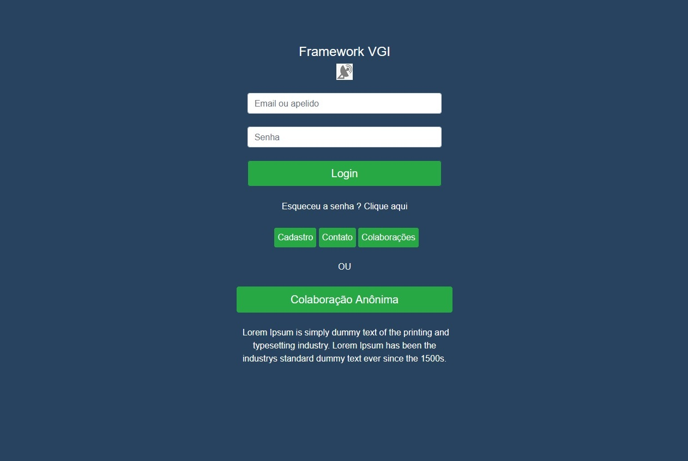
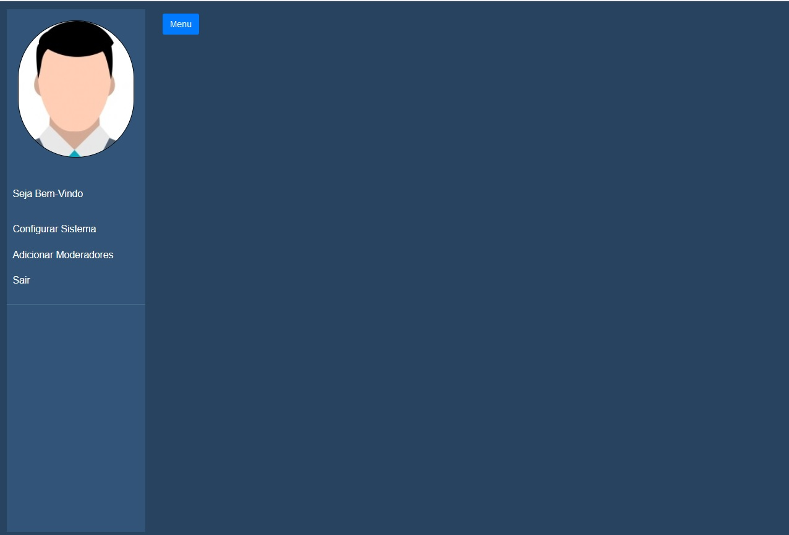

<h1>Framework para Sistemas VGI</h1>

<h2>Trabalho de conclusão de curso (TCC)</h2>

<strong>Português</strong>

Esse projeto é de um framework inspirado no <a href="http://www.dpi.ufv.br/projetos/clickonmap/">ClickOnMap</a> para facilitar o desenvolvimento de sistemas que utilizam VGI como forma de obtenção de dados georreferenciados (que possuem latitude e longitude).
 

O sistema permite o compartilhamento de informações por usuários, associando-as a pontos, linhas e polígonos traçados no mapa e permitindo a exportação dos dados no formato GeoJSON, permitindo assim o dimensionamento dos fatos observados e a comunicação do sistema com outros sistemas de informação geográfica.

<strong>English</strong>

This project is a framework inspired on <a href="http://www.dpi.ufv.br/projetos/clickonmap/">ClickOnMap</a> for easily the systems development that used to VGI for get spatial data.

The framework permit to share the users informations associate with points, lines or polygons in the map and export the spatial data in geojson or csv formats, adding the facts dimensionality and the comunication from this systems to all others GIS.

<h2>Tecnologias utilizadas:</h2>
-HTML5
 -CSS3
 -Javascript
 -Bootstrap
 -Leaflet
 -PostgreSQL 
 -Frontend: VUE
 -Backend: NodeJS (Express)
<h2>Funcionalidades iniciais:</h2>

Na tela inicial do sistema, ficam disponíveis as seguintes funcionalidades iniciais:

-Cadastro de novo usuário
 -Formulário para contato
 -Visualização das colaborações já realizadas e aprovadas
 -Exportação das colaborações nos formatos GeoJSON e CSV
 -Possibilidade de realizar a colaboração de forma anônima

<h2>Tipos de usuários e funcionalidades:</h2>
-Root (Super Usuário)
 

  -Administrador
 

  -Anônimo
 

  -Colaborador
 

<h2>Rotas criadas:</h2>
-/home:
 /cadastroNovoUsuario:
 /novoContato:
 /login:
 /perfil: Retorna o nome, apelido, email, faixa etaria e tipo do usuário que está logado no sistema. 
 /trocarSenha:
 /setCategoria: Busca no banco de dados a categoria fornecida e caso ainda não esteja cadastrada no sistema, insere ela. 
 /getCategoria: Retorna todas as categorias inseridas. 
 /setSubcategoria: Busca no banco de dados a subcategoria fornecida e caso ainda não esteja cadastrada no sistema, insere ela. 
 /getSubcategoria: Retorna todas as subcategorias inseridas. 
 /setColaboracao: Insere no banco de dados a colaboração com todos os atributos informados pelo usuário e com o atributo publicado = "não".
 /getColaboracoes: Retorna todas as colaborações com o atributo publicado = "sim". 
 /exportar:
 /getContatos: Retorna os campos idcontato, nome, assunto, email, data e mensagem de todas as colaborações que foram realizadas para o sistema e com a propriedade publicado = "sim". 
 /alterarStatusColaboracao: Altera o status da colaboração para publicado = "sim", tornando-a visível na tela de "Colaborações". 
 /verColaboracoes:
 /setConfInicial:
 /setAdministradores:
 /getColaboradores:
 /apagarContato: Atualiza o status de um contato recebido como "publicado = não", mantendo assim a integridade do banco de dados.

<h2>Como usar:</h2>

A aplicação trabalha com dois servidores: localhost:3000 (servidor Express) e localhost:8081 (servidor do VUE).

Além disso, é necessário criar o banco de dados PostgreSQL com o script da pasta "banco de dados/esquema.txt"

<h2>Observação:</h2>

<strong>Português</strong>

Cada categoria adicionada pelo usuário administrador deve conter pelo menos uma subcategoria cadastrada no sistema.

A inserção dos polígonos não respeita a Regra da Mão Direita.

<strong>English</strong>

Each category add by administrator user need a once subcategory add too in the system.

The polygon insertion don't follow the righ-hand rule.

<h2>Instalação</h2>
<h3>Dependências</h3>

npm install

<h3>Executar servidor VUE</h3>

npm run dev

<h3>Executar servidor Express</h3>

node app.js

